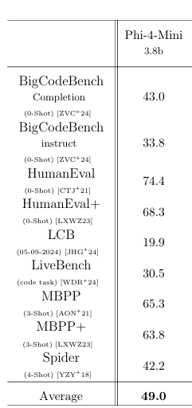

# Local LLM Agent System - Postman Collection Analyzer

This project demonstrates the integration of a **Local LLM Agent** with **Postman Collection** data retrieval. It creates an intelligent assistant that can analyze, search, and extract information from Postman Collections while running entirely on your local machine.

## 🌟 Key Features

- **Local LLM Integration**: Uses Ollama with Mistral-Nemo and Phi4-Mini for local inference without relying on cloud services
- **Streaming Agent Reasoning**: See the agent's thought process in real-time with step-by-step streaming
- **Action-equipped AI**: Agent can use specialized actions to analyze Postman Collections
- **Beautiful UI**: Modern, responsive Streamlit interface with clean visualization of agent reasoning
- **Robust Error Handling**: Gracefully handles errors and provides helpful feedback
- **Collection Selection**: Select your Postman Collection JSON files from a designated folder in the UI
- **Detailed Collection Analysis**: Get statistics, HTTP method analysis, endpoint details, and more
- **Semantic Search (RAG)**: Uses HuggingFace sentence-transformers and ChromaDB for fast, persistent semantic search over endpoints

## 📊 Technical Report

### Model Selection
- **Mistral-Nemo**: Used as the main agent because it supports tool calling functionality, which is essential for the agent's ability to use specialized actions to interact with Postman collections
- **Phi4-Mini**: Used for coding and summarization tasks due to its superior performance on coding benchmarks, despite not supporting tool calling directly

### Technology Stack
- **Backend Server**: FastAPI for high-performance API endpoints with asynchronous support
- **LLM Integration**: LangChain and LangGraph for agent orchestration, with Ollama enabling fast local model deployment
- **Observability**: Integrated with LangFuse to track each step for debugging and iteration
- **Vector Database**: ChromaDB for efficient storage and retrieval of embeddings used in semantic search
- **Model Size Considerations**: Models in the 3B–15B parameter range are selected to balance inference speed and hardware requirements for local deployment

### Future Improvements
- **Switch to vLLM**: Replace Ollama with vLLM for improved inference performance and throughput
- **Enhanced Evaluation**: Implement LLM-as-judge for better agent response evaluation
- **Safety Guardrails**: Add NeMo Guardrails for content filtering and safety
- **Fallback Handling**: Develop specialized fallback handling agents for error recovery
- **Memory Management**: Implement advanced memory systems like Letta or Mem0 for better context retention

## 🔄 System Diagram


*The diagram illustrates the flow of data and interactions between the different components of the system.*

## 📊 Model Benchmarks

### Mistral-Nemo Performance


*Benchmark results showing Mistral-Nemo's performance on code-related tasks.*

### Phi4-Mini Performance



*Benchmark results demonstrating Phi4-Mini's superior performance on coding tasks, which is why it was selected for code summarization and analysis.*

## 📦 Project Structure

```
project/
├── backend/
│   ├── main.py            # FastAPI server
│   ├── agents.py          # Agent configuration, actions, streaming
│   ├── actions.py         # Action implementations
│   ├── prompt.py          # LLM system prompts
│   ├── config.py          # Configuration settings
│   ├── schemas.py         # Pydantic schemas
│   ├── store.py           # Shared state storage
│   ├── tools/
│   │   ├── rag_tools.py   # RAG/semantic search tools
│   ├── data/
│   │   ├── collections/   # Place your Postman Collection JSON files here
│   │   └── chroma_db/     # Persistent vector DB for semantic search
├── frontend/
│   ├── app.py             # Streamlit UI frontend
│   ├── styles/            # CSS styling
│   └── img/               # UI images and assets
├── requirements.txt       # Python dependencies
├── README.md              # Documentation
```

## 🔧 Setup Instructions

### 1. Prerequisites

- Python 3.9+ installed on your system
- Git (optional, for cloning the repository)
- Sufficient disk space (~2GB) for dependencies and models

You can check your Python version with:

```bash
python --version  # or python3 --version on some systems
```

### 2. Set Up a Virtual Environment

Setting up a virtual environment is crucial for isolating project dependencies from your system Python installation. This prevents conflicts with other Python projects.

#### Detailed Steps:

1. **Install Python venv package** (if not already available):

```bash
# For Ubuntu/Debian
sudo apt-get install python3-venv

# For macOS (using Homebrew)
brew install python3
```

2. **Create a virtual environment**:

Navigate to your project directory and run:

```bash
python -m venv venv  # Create a virtual environment named 'venv'
```

3. **Activate the virtual environment**:

```bash
# On macOS/Linux
source venv/bin/activate

# On Windows (Command Prompt)
venv\Scripts\activate

# On Windows (PowerShell)
.\venv\Scripts\Activate.ps1
```

4. **Verify activation**:

You should see `(venv)` at the beginning of your command prompt. You can also verify the Python path:

```bash
which python  # macOS/Linux
where python  # Windows
```

This should point to the Python interpreter in your virtual environment.

5. **Deactivation** (when you're done working on the project):

```bash
deactivate
```

#### Troubleshooting Virtual Environment Issues:

- **PowerShell Execution Policy**: If you receive an error about execution policies on Windows, try running:
  ```powershell
  Set-ExecutionPolicy -ExecutionPolicy RemoteSigned -Scope CurrentUser
  ```

- **Command Not Found**: If `venv` is not recognized, ensure you have the latest Python version installed.

- **Permission Denied**: On Unix-based systems, you might need to add execute permissions:
  ```bash
  chmod +x venv/bin/activate
  ```

### 3. Install Dependencies

With your virtual environment activated, install the required packages:

```bash
pip install -r requirements.txt
```

This will install all the necessary dependencies listed in the requirements.txt file, including Streamlit, FastAPI, LangChain, langgraph, ChromaDB, and HuggingFace sentence-transformers for semantic search.

To verify installations:

```bash
pip list
```

### 4. Set Up Environment Variables

The application uses a `.env` file to manage configuration and API keys. 

Create a new file named `.env` in the project root and add the following variables:

```
# API Keys
TAVILY_API_KEY=your_tavily_api_key_here  # Get this from tavily.com for web search

# LLM Configuration
MAIN_LLM_MODEL=mistral-nemo    # Main router/supervisor model
CODING_LLM_MODEL=phi           # Model for coding and summarization tasks
LLM_TEMPERATURE=0.1
LLM_NUM_PREDICT=128000

# Tool Configuration
TAVILY_MAX_RESULTS=5

# (Optional) Langfuse for tracing/monitoring
LANGFUSE_PUBLIC_KEY=your_langfuse_public_key
LANGFUSE_SECRET_KEY=your_langfuse_secret_key
LANGFUSE_HOST=https://cloud.langfuse.com
```

The `.env` file should be kept private and never committed to version control.

#### Troubleshooting .env Issues
- If you see errors about missing API keys or configuration, double-check your `.env` file and variable names.
- The backend will not start correctly without required keys (e.g., TAVILY_API_KEY for web search).

### 5. Install and Start Ollama (Local LLM)

If you haven't installed [Ollama](https://ollama.com/):

- Install Ollama on your machine (available for macOS, Linux, and Windows)
- Start the Ollama server
- Pull the required models:

```bash
# Pull Mistral-Nemo (used as the main router/supervisor)
ollama pull mistral-nemo

# Pull Phi-4-Mini (used for coding and summarization tasks)
ollama pull phi4-mini
```

#### Model Selection Strategy

This project uses a dual-model approach:
- **Mistral-Nemo**: Used as the main router/supervisor for general chat interactions and action routing
- **Phi-4-Mini**: Specialized model for coding-related tasks and text summarization due to its superior performance on coding benchmarks

⚡ **Make sure Ollama is running in the background.**

### 6. Prepare Your Postman Collections

**Place all your Postman Collection JSON files in the following folder:**

```
backend/data/collections/
```

The application will only recognize and allow you to select collections from this folder. You must manually copy or move your files here before starting the app.

### 7. Start Backend Server (FastAPI)

From the **project root** directory:

```bash
uvicorn backend.main:app --reload --host 0.0.0.0 --port 8000
```

Backend will run at:

```
http://localhost:8000
```

### 8. Start Frontend Server (Streamlit)

In another terminal window:

```bash
cd frontend
streamlit run app.py
```

Frontend will be available at:

```
http://localhost:8501
```

## 🚀 How to Use

1. Open the Streamlit web UI at http://localhost:8501
2. Use the sidebar to:
   - Select a Postman Collection JSON file from the dropdown (these are the files you placed in `backend/data/collections`)
   - Try example queries with one-click buttons
3. Enter your question in the chat input field, for example:
   - "List all available collections"
   - "Load a Postman collection"
   - "List all endpoints in the collection"
   - "Search for endpoints related to 'account'"
   - "Analyze the HTTP methods used in the collection"
   - "What kind of API is this collection for?"

4. Watch the agent:
   - Think through the problem
   - Call relevant actions
   - Return structured information
   - Provide a final answer

## 🧰 Available Actions

The agent has access to these specialized actions:

1. **load_postman_collection**: Load and parse a Postman Collection JSON file
2. **clear_collection**: Clear the loaded collection from memory
3. **list_all_endpoints**: List all API endpoints from the loaded collection
4. **search_endpoints_by_keyword**: Search endpoints containing a specific keyword
5. **summarize_collection**: Provide a summary of the loaded collection
6. **get_endpoint_details**: Get detailed information about a specific endpoint
7. **analyze_collection_methods**: Analyze HTTP methods used in the collection
8. **extract_request_examples**: Extract and analyze request examples
9. **rag_search_endpoints**: Semantic search for endpoints using RAG
10. **ask_collection_analyst**: Get specialized analysis of the collection
11. **ask_software_engineer**: Get technical insights about the API
12. **web_search**: Search the web for additional information (using Tavily)

## 💡 Example Queries

Here are some example queries to try:

- "List all available collections"
- "Load a Postman collection"
- "What is this collection about?"
- "List all the GET endpoints"
- "Find endpoints related to users"
- "What HTTP methods are used in this collection?"
- "Explain the /accounts endpoint in detail"
- "Show me some example POST requests"
- "What authentication methods are used in this API?"

## 🔍 Troubleshooting

| Problem | Solution |
|:---|:---|
| Backend not reachable | Check if Ollama is running, port 8000 is open |
| Model missing | Run `ollama pull mistral-nemo` or `ollama pull phi4-mini` |
| API Key error | Make sure TAVILY_API_KEY is set correctly in your .env |
| Streamlit not updating | Refresh the browser tab |
| File selection errors | Make sure your JSON files are in `backend/data/collections` |
| Slow responses | The first query might be slow as the model loads |
| Virtual environment issues | Ensure you have the correct Python version and venv package |
| Package installation errors | Try `pip install --upgrade pip` before installing requirements |
| .env/config errors | Double-check your .env file and variable names |